<div align="center">


<h1>IdP Benchmark Platform</h1>

<p><strong>The Institutional-Grade Quantitative Comparison and Selection Platform for Enterprise Identity Providers</strong></p>

[]()
[]()
[]()
[]()

<br/>

> **"If you can't measure it, you can't secure it."** 
> IdP Benchmark is a flagship platform designed to enable enterprises to evaluate, compare, and score Identity Providers (IdPs) across critical dimensions. From security capability to global performance latency, it provides the data-driven insights required for institutional identity selection.

</div>

---

## 🏛️ Executive Summary

The **IdP Benchmark Platform** is a specialized flagship solution designed for CIOs, CISOs, and Identity Architects. Selecting an Identity Provider is one of the most critical long-term infrastructure decisions an enterprise can make. Yet, these decisions are often based on marketing collateral rather than objective, quantitative data.

This platform provides a **Unified Benchmarking Engine**. It demonstrates how to orchestrate real-world workload simulations—such as high-volume authentication bursts and complex conditional access evaluations—using **FastAPI**, **React 18**, and **Analytics Workers**. By generating detailed **Maturity Scorecards**, **Cost Heatmaps**, and **Performance Trendlines**, it enables organizations to select the right IdP for their specific multi-cloud and Zero Trust requirements.

---

## 📉 The "Selection Complexity" Problem

Enterprises evaluating IdPs face significant challenges:
- **Feature Parity Confusion**: Difficulty distinguishing between "marketing features" and real-world operational maturity.
- **Hidden Performance Gaps**: Latency differences between providers that impact global user experience.
- **Complex Cost Models**: Predicting the total cost of ownership (TCO) including licensing, integration, and operational overhead.
- **Zero Trust Readiness**: Measuring how effectively an IdP supports modern security principles like "Continuous Access Evaluation" (CAE).

---

## 🚀 Strategic Drivers & Business Outcomes

### 🎯 Strategic Drivers
- **Standardized Vendor Evaluation**: Moving from subjective assessment to objective, data-driven scoring.
- **Optimization of Multi-Cloud IAM**: Benchmarking how well different IdPs integrate with AWS, Azure, and GCP.
- **Procurement Acceleration**: Providing procurement teams with standardized risk and capability reports.

### 💰 Business Outcomes
- **Optimized TCO**: Identifying the most cost-efficient IdP based on specific enterprise usage patterns.
- **Improved UX**: Selecting providers with the lowest global authentication and token issuance latency.
- **Enhanced Security Posture**: Prioritizing IdPs with the strongest MFA, Zero Trust, and Compliance features.

---

## 📐 Architecture Storytelling: 30+ Advanced Diagrams

### 1. Executive Benchmarking Architecture
*The orchestration of synthetic testing into vendor scorecards.*
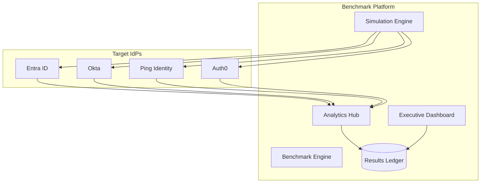

### 2. Multi-Cloud Test Topology
*Measuring performance from different global regions.*
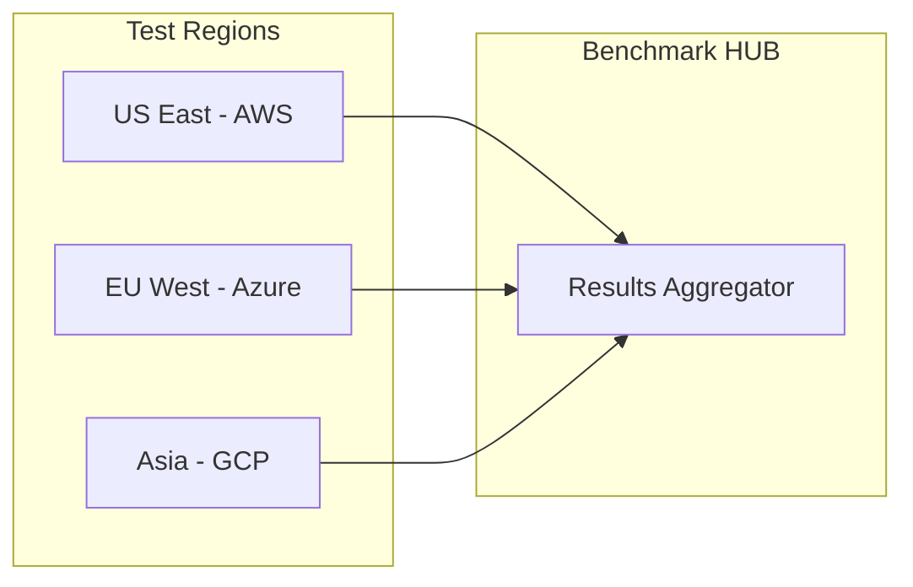

### 3. Authentication Flow Benchmarking
*The steps measured during a synthetic auth test.*
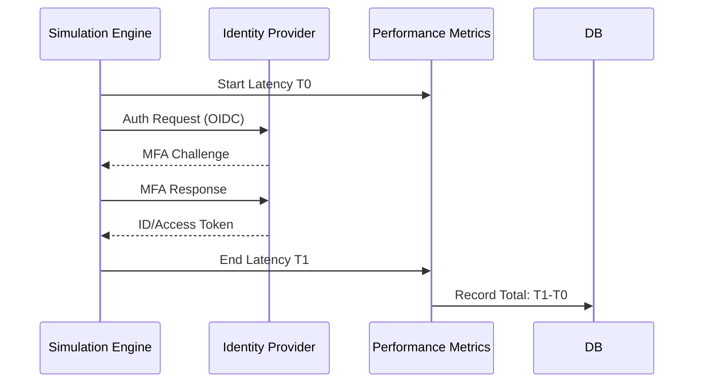

### 4. MFA Capability Benchmarking
*Comparing the strength of available MFA methods.*
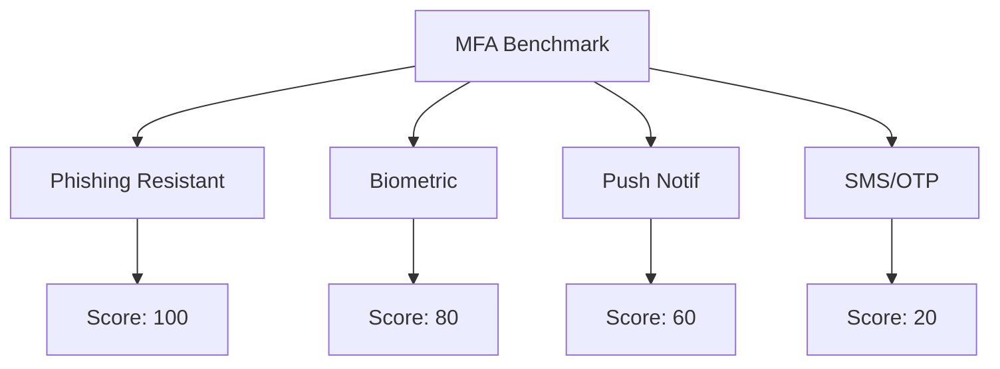

### 5. Conditional Access Benchmarking
*Measuring the complexity and speed of policy evaluation.*
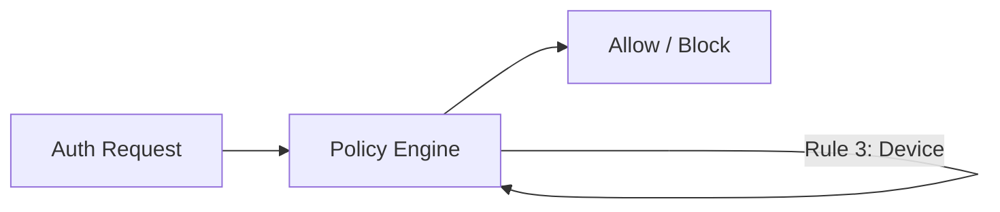

### 6. Zero Trust Maturity Model
*Mapping IdP capabilities to Zero Trust pillars.*
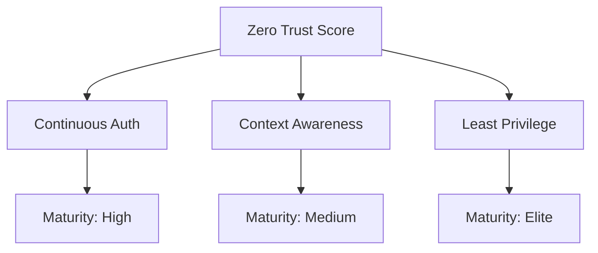

### 7. Cost Modeler Flow
*Calculating the economic impact of IdP selection.*
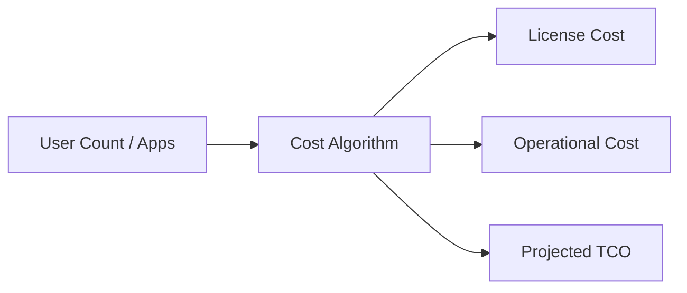

### 8. Directory Sync Performance
*Benchmarking the speed of user object propagation.*
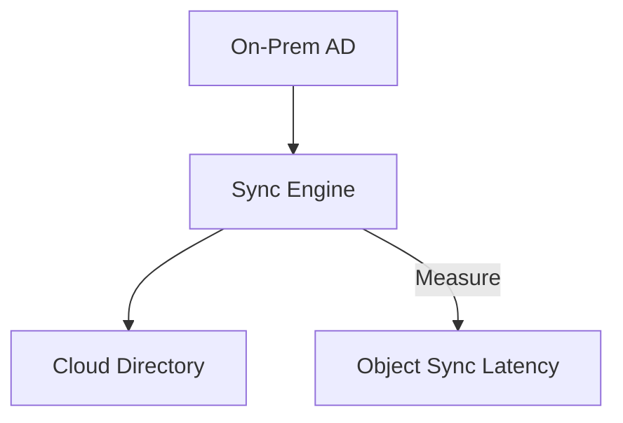

### 9. API Throughput Testing
*Measuring the limits of the IdP Management API.*
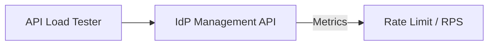

### 10. Vendor Risk & Compliance Scoring
*Aggregating certifications and security posture.*
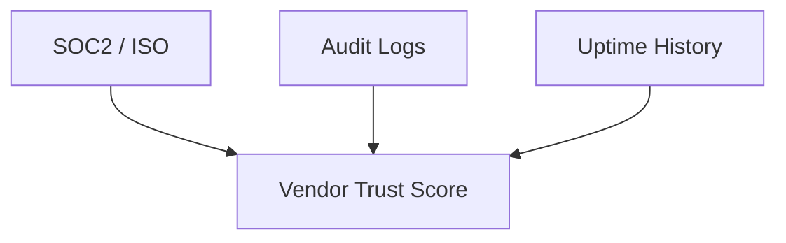

### 11. Token Issuance Latency Model
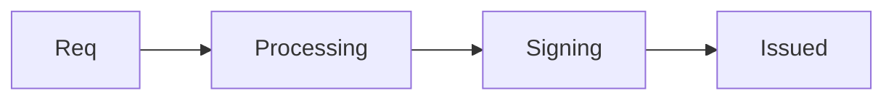

### 12. Federation Handshake Flow (SAML)
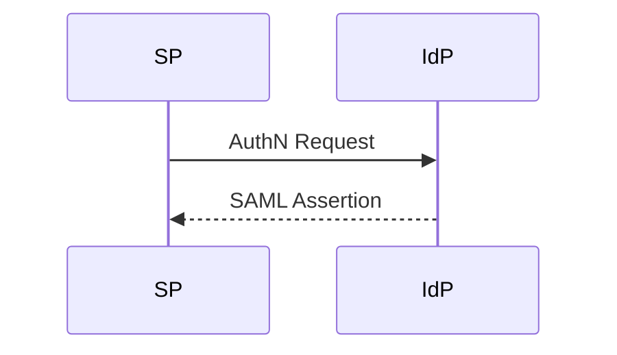

### 13. Failover Resilience Model
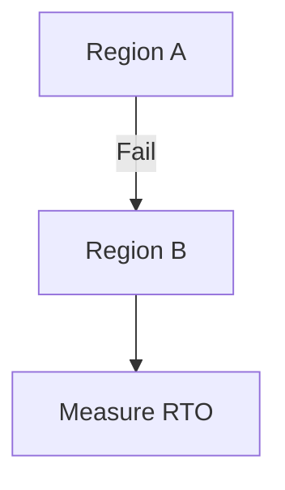

### 14. SLA Compliance scoring
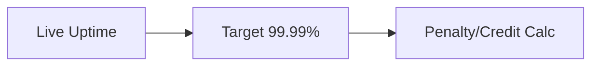

### 15. Benchmark Replay Engine
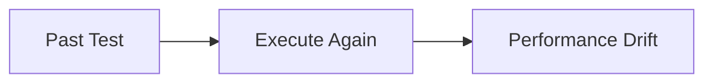

### 16. OIDC Discovery Performance
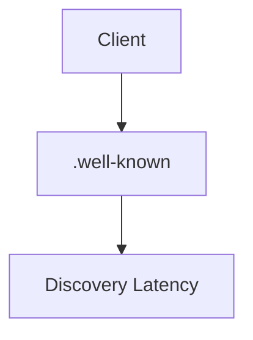

### 17. User Experience Score (UXI)
```mermaid
graph LR
    Lat[Latency] + Prompts[MFA Frequency] --> UX[UX Index]
```

### 18. Global Edge Latency Heatmap
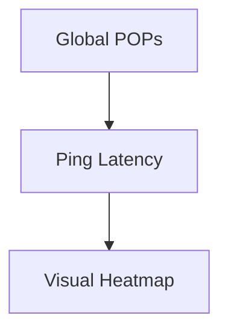

### 19. Identity Data Ingestion Pipeline
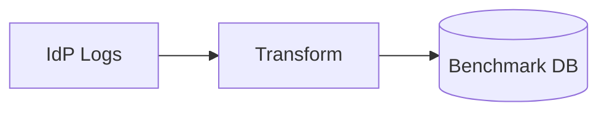

### 20. RBAC Complexity Benchmark
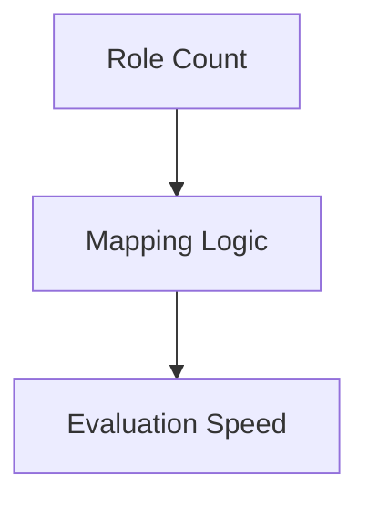

### 21. Entra ID Integration Flow
```mermaid
graph LR
    Client[Client] --> Entra[Entra ID Endpoint]
```

### 22. Okta Integration Flow
```mermaid
graph LR
    Client[Client] --> Okta[Okta API/Auth]
```

### 23. Keycloak Self-Hosted Benchmark
```mermaid
graph TD
    DB[Local DB] --> KC[Keycloak Pods]
    KC --> Measure[Throughput]
```

### 24. AWS IAM Identity Center Bench
```mermaid
graph LR
    User[User] --> AWS[AWS Auth]
```

### 25. Google Identity Bench
```mermaid
graph LR
    User[User] --> Google[Google Workspace Auth]
```

### 26. Procurement ROI Model
```mermaid
graph TD
    Cost[Price] --> Benefit[Security/UX Value]
    Benefit --> ROI[ROI Score]
```

### 27. Feature Completeness Matrix
```mermaid
graph TD
    F[Feature Set] --> Gap[Gap Analysis]
```

### 28. Incident Reporting Pipeline
```mermaid
graph LR
    Error[Test Failed] --> Alert[Ops Alert]
```

### 29. Multi-Tenant Topology
```mermaid
graph LR
    OrgA[Org A] --> Bench[Bench Platform]
    OrgB[Org B] --> Bench
```

### 30. Strategic Roadmap Cycle
```mermaid
graph TD
    Audit[Now] --> Select[Selection]
    Select --> Optimize[Post-Migration]
```

---

## 🛠️ Technical Stack & Implementation

### Benchmarking Engine
- **Language**: Python 3.11+
- **Framework**: FastAPI
- **Simulation**: Asyncio for high-concurrency auth simulations.

### Frontend (Executive Dashboard)
- **Framework**: React 18 / Vite
- **Visuals**: Recharts (Radar charts for maturity scores).
- **Icons**: Lucide Benchmark/Shield Icons.

### Infrastructure
- **IaC**: Terraform (AWS RDS/EKS deployment).
- **Monitoring**: Prometheus/Grafana (SLA and Latency tracking).

---

## 🚀 Deployment Guide

### Local Development
```bash
# Clone the repository
git clone https://github.com/devopstrio/idp-benchmark.git
cd idp-benchmark

# Setup environment
cp .env.example .env

# Launch platform
make up
```
Access the Benchmark Dashboard at `http://localhost:3000`.

---

## 📜 License
Distributed under the MIT License. See `LICENSE` for more information.
