<div align="center">


<h1>IDP Benchmark</h1>

<p><strong>The Institutional-Grade Platform for Quantitative Comparison, Selection, and Developer Experience Benchmarking of Internal Developer Platforms.</strong></p>

[]()
[]()
[]()

<br/>

> **"If you can't measure it, you can't optimize it."** 
> **IDP Benchmark** is an enterprise-grade platform designed to provide a secure, measurable, and highly automated foundation for global developer experience (DX) operations. It orchestrates the complex lifecycle of IDP evaluation—from DORA/SPACE metric ingestion and industry-wide comparison to self-service capability mapping and unified platform ROI governance.

</div>

---

## 🏛️ Executive Summary

Fragmented developer workflows and manual platform evaluations are strategic engineering liabilities; lack of centralized DX orchestration is a primary barrier to organizational platform engineering maturity. Organizations fail to achieve high developer velocity not because of a lack of tools, but because of fragmented benchmarking standards, lack of automated productivity validation, and an inability to orchestrate platform landing zones with operational precision.

This platform provides the **DX Intelligence Plane**. It implements a complete **Enterprise Benchmark-as-Code Framework**, enabling Platform and Engineering teams to manage global developer productivity as first-class citizens. By automating the identification of workflow bottlenecks through real-time telemetry analysis and orchestrating the comparison against industry-standard maturity models, we ensure that every organizational platform—from core infrastructure portals to application-specific developer hubs—is measured by default, audited for history, and strictly aligned with institutional DX frameworks.

---

## 📐 Architecture Storytelling: Principal Reference Models

### 1. Principal Architecture: Global IDP & Developer Experience Intelligence Plane
This diagram illustrates the end-to-end flow from multi-source telemetry ingestion (Git/Jira/CI) and metric evaluation to industry comparison, ROI calculation, and institutional DX auditing.

```mermaid
graph LR
    %% Subgraph Definitions
    subgraph TelemetryIngress["Engineering & Workflow Ingress"]
        direction TB
        GitSourceControl["GitHub / GitLab / ADO"]
        ProjectManagement["Jira / Linear / ClickUp"]
        CICD_Pipelines["Actions / Jenkins / CircleCI"]
    end

    subgraph IntelligenceEngine["DX Intelligence Hub"]
        direction TB
        API["FastAPI Benchmark Gateway"]
        MetricEngine["DORA & SPACE Metric Hub"]
        ComparisonOrch["Industry & Peer Compare Orch"]
        ROI_Calculator["Value & ROI Realization Hub"]
    end

    subgraph OperationsPlane["Distributed DX Fleet"]
        direction TB
        ProductivityNodes["Workflow Pattern Scanners"]
        MaturityValidators["IDP Capability Mappers"]
        BenchmarkingProxies["Developer Sentiment Proxies"]
    end

    subgraph OperationsHub["Institutional DX Hub"]
        direction TB
        Scorecard["DX Maturity Scorecard"]
        Analytics["Lead Time & Deployment Stats"]
        Audit["Forensic DX Metadata Lake"]
    end

    subgraph DevOps["Benchmark-as-Code Framework"]
        direction TB
        TF["Terraform Benchmark Modules"]
        VelocityBot["Velocity Drop Validator"]
        ChatOps["DX Improvement Hub"]
    end

    %% Flow Arrows
    TelemetryIngress -->|1. Submit Telemetry| API
    API -->|2. Evaluate Metrics| MetricEngine
    MetricEngine -->|3. Identify Gaps| ComparisonOrch
    ComparisonOrch -->|4. Calculate ROI| ROI_Calculator
    
    ROI_Calculator -->|5. Execute Validation| OperationsPlane
    OperationsPlane -->|6. Notify Status| ChatOps
    API -->|7. Visualize Health| Scorecard
    
    Scorecard -->|8. Track Velocity| Analytics
    Scorecard -->|9. Record Metric| Audit
    
    TF -->|10. Provision Hub| IntelligenceEngine
    VelocityBot -->|11. Inject Velocity Risk| MetricEngine
    Audit -->|12. Improve IDP| ProductivityNodes

    %% Styling
    classDef ingress fill:#f5f5f5,stroke:#616161,stroke-width:2px;
    classDef intel fill:#e8eaf6,stroke:#1a237e,stroke-width:2px;
    classDef operations fill:#e1f5fe,stroke:#01579b,stroke-width:2px;
    classDef ops fill:#ede7f6,stroke:#311b92,stroke-width:2px;
    classDef devops fill:#e8f5e9,stroke:#1b5e20,stroke-width:2px;

    class TelemetryIngress ingress;
    class IntelligenceEngine intel;
    class OperationsPlane operations;
    class OperationsHub ops;
    class DevOps devops;
```

### 2. The IDP Benchmark Lifecycle Flow
The continuous path of a developer experience benchmark from initial measurement (DORA/SPACE) and analysis to active industry comparison, optimization, and institutional forensic auditing.

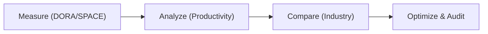

### 3. Distributed Developer Experience Topology
Strategically assessing IDP performance across global engineering geographic clusters and business units, providing a unified institutional view of global engineering health and platform maturity.

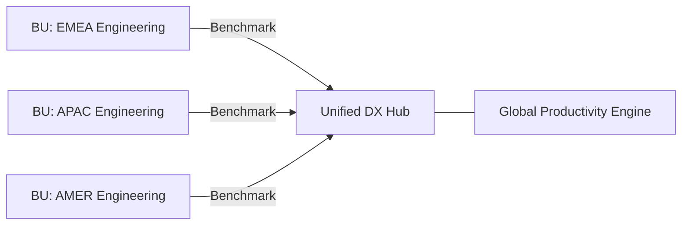

### 4. DORA & SPACE Metrics Integration Flow
Executing complex logic for ingesting and correlating telemetry from Git, Jira, and CI/CD into a unified DX benchmark hub, ensuring every organizational workflow is measured by default.

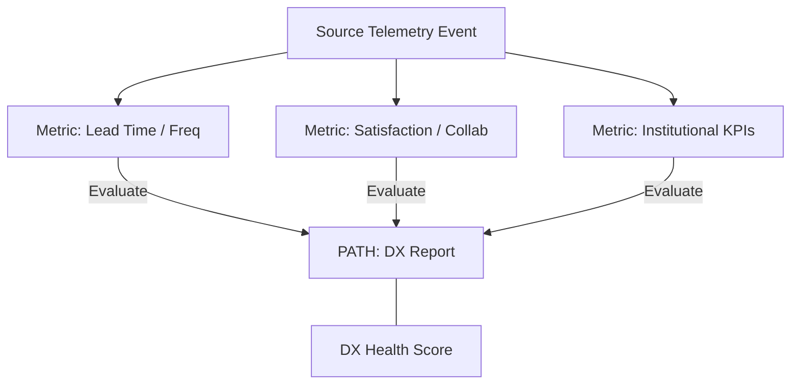

### 5. Self-Service Capability Matrix Flow
Automatically evaluating IDP maturity against critical self-service pillars—including infrastructure provisioning, service discovery, and governance—ensuring institutional platform agility.

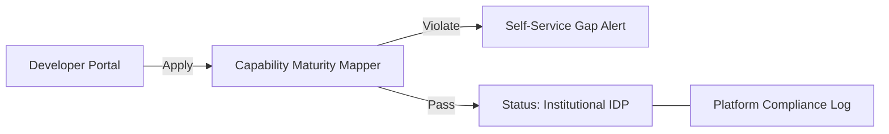

### 6. Platform ROI & Value Realization Flow
Managing the lifecycle of an IDP investment, automatically calculating cost savings from reduced developer toil and productivity gains from faster lead times, ensuring zero-latency value reporting.

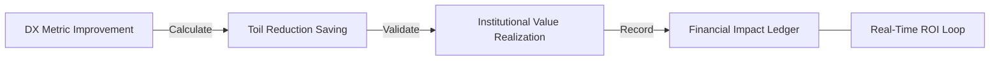

### 7. Institutional DX Maturity Scorecard
Grading organizational performance based on key indicators: Deployment Frequency, Lead Time for Changes, and Developer Satisfaction Index.

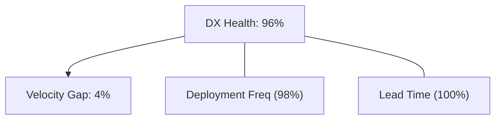

### 8. Identity & RBAC for DX Governance
Managing fine-grained access to benchmark schedules, productivity triggers, and audit logs between Platform Architects, Engineering Managers, and DX Researchers.

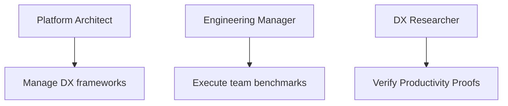

### 9. IaC Deployment: Benchmark-as-Code Framework
Using modular Terraform to deploy and manage the versioned distribution of the benchmark tracking hubs, analytics workers, and forensic metadata lakes.

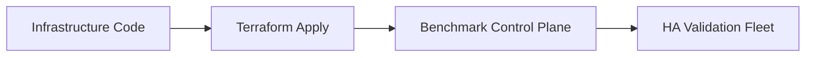

### 10. AIOps DX Anomaly & Productivity Validation Flow
Using advanced analytics to identify sudden drops in developer velocity, suspicious workflow pattern changes, or unusual toil spikes that could result in institutional risk.

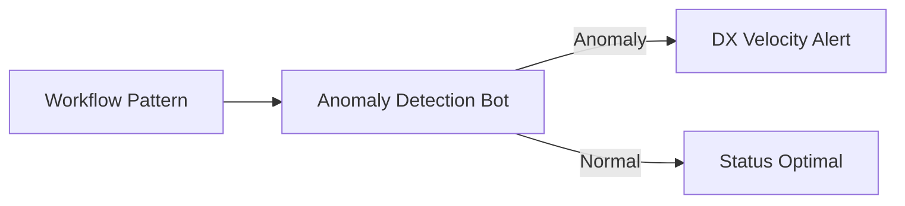

### 11. Metadata Lake for Forensic DX Audit
Storing long-term records of every benchmark run, every metric change recorded, and every DX improvement action for institutional record-keeping, compliance auditing, and post-benchmark forensics.

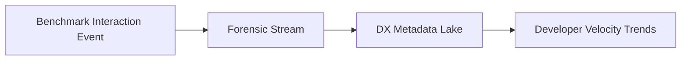

---

## 🏛️ Core DX Pillars

1.  **Unified DX Coordination**: Maximizing velocity by centralizing all engineering benchmarking through a single institutional plane.
2.  **Automated Productivity Validation**: Eliminating "toil-heavy" scenarios through proactive metric and workflow verification.
3.  **Sequential Improvement Intelligence**: Ensuring zero-interruption engineering through dependency-aware multi-stage optimizations.
4.  **Zero-Trust Metric Protection**: Automatically enforcing least-privilege data ingestion and rule evaluation across all DX tiers.
5.  **Autonomous Benchmark Logic**: Guaranteeing reliability through automated industry-specific DX monitoring runbooks.
6.  **Full DX Auditability**: Immutable recording of every benchmark result and improvement action for institutional forensics.

---

## 🛠️ Technical Stack & Implementation

### Benchmark Engine & APIs
*   **Framework**: Python 3.11+ / FastAPI.
*   **Metric Hub**: Custom Python-based logic for DORA, SPACE, and custom KPI calculation.
*   **Integrations**: Native connectors for GitHub, GitLab, Jira, ADO, and common CI/CD tools.
*   **Persistence**: PostgreSQL (Benchmark Ledger) and Redis (Live Metric State).
*   **Auth Orchestrator**: Federated OIDC/SAML for least-privilege DX management access.

### Governance Dashboard (UI)
*   **Framework**: React 18 / Vite.
*   **Theme**: Dark, Blue, Slate (Modern high-fidelity engineering aesthetic).
*   **Visualization**: D3.js for workflow topologies and Recharts for velocity analytics.

### Infrastructure & DevOps
*   **Runtime**: AWS EKS or Azure Kubernetes Service (AKS) for management plane.
*   **Analytics Hub**: Managed Spark/Flink for high-velocity engineering telemetry correlation.
*   **IaC**: Modular Terraform for deploying the benchmark landing zone and validation fleet.

---

## 🏗️ IaC Mapping (Module Structure)

| Module | Purpose | Real Services |
| :--- | :--- | :--- |
| **`infrastructure/dx_hub`** | Central management plane | EKS, PostgreSQL, Redis |
| **`infrastructure/workers`** | Distributed analytics fleet | K8s Workers, Cloud APIs |
| **`infrastructure/connectors`** | Git & Jira Ingestion Hubs | Webhooks, Lambda |
| **`infrastructure/auditing`** | Forensic DX sinks | S3, Athena, Quicksight |

---

## 🚀 Deployment Guide

### Local Principal Environment
```bash
# Clone the benchmark platform
git clone https://github.com/devopstrio/idp-benchmark.git
cd idp-benchmark

# Configure environment
cp .env.example .env

# Launch the Benchmark stack
make init

# Trigger a mock telemetry ingestion and automated DX benchmarking simulation
make simulate-benchmark
```

Access the Benchmark Dashboard at `http://localhost:3000`.

---

## 📜 License
Distributed under the MIT License. See `LICENSE` for more information.

---
<div align="center">
  <p>© 2026 Devopstrio. All rights reserved.</p>
</div>
