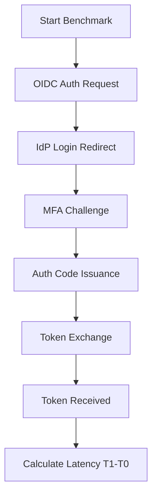
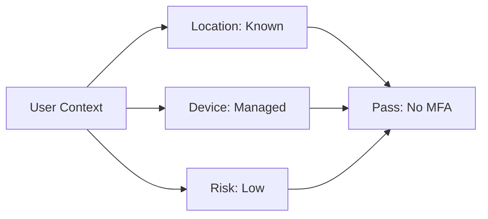
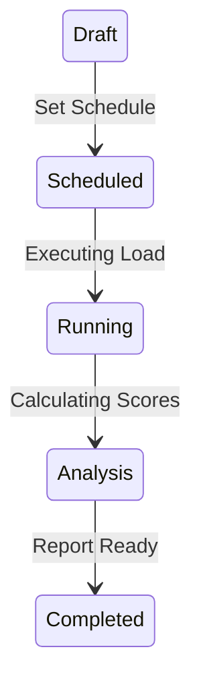

# Architecture & Simulation Diagrams

## 11. Authentication Flow Benchmarking (Detailed)
*How the simulation engine measures every step of the OIDC handshake.*

## 13. Conditional Access Test Matrix

## 20. Benchmark Lifecycle

