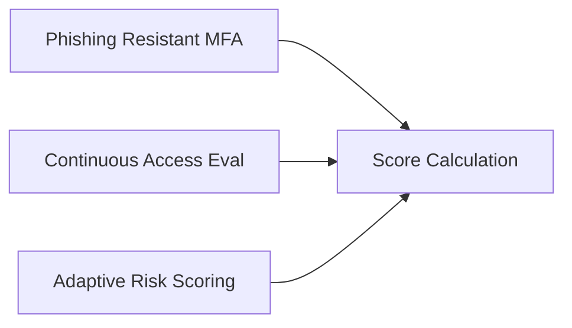
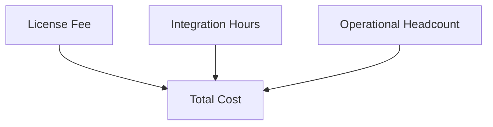
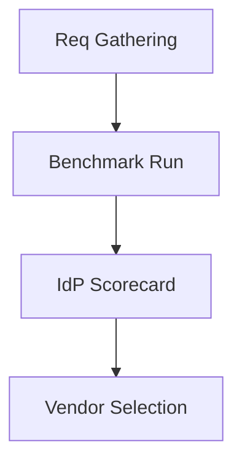

# Security & Comparison Diagrams

## 31. Security Feature Comparison

```mermaid
graph LR
    F1[Phishing Resistant MFA] --> Compare[Score Calculation]
    F2[Continuous Access Eval] --> Compare
    F3[Adaptive Risk Scoring] --> Compare
```

## 34. Cost Comparison Modeler

```mermaid
graph TD
    License[License Fee] --> TCO[Total Cost]
    Integration[Integration Hours] --> TCO
    Ops[Operational Headcount] --> TCO
```

## 40. Vendor Selection Flow

```mermaid
graph TD
    Req[Req Gathering] --> Bench[Benchmark Run]
    Bench --> Score[IdP Scorecard]
    Score --> Select[Vendor Selection]
```
